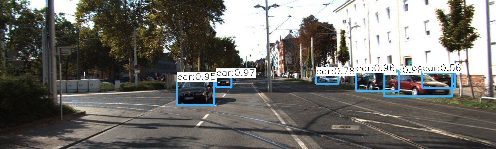

# cppND-capstone-Yolov3-object-detection

This repository contains an implementation of the project in [Udacity C++ Nanodegree Program](https://www.udacity.com/course/c-plus-plus-nanodegree--nd213).

I use OpenCV and Yolov3 to implement a highly capable object detection model. It takes in single image and outputs the annotated image based on the object detector's predictions. 

The fulfilled rubic points are as follows:

1- A README with instructions is included with the project. 

2- The README indicates which project is chosen.

3- The README includes information about each rubric point addressed.

4- The submission must compile and run.

5- The project demonstrates an understanding of C++ functions and control structures.

6- The project reads data from a file and process the data, or the program writes data to a file.

7- The project accepts user input and processes the input.

8- The project uses Object Oriented Programming techniques.

9- Classes use appropriate access specifiers for class members.

10- Class constructors utilize member initialization lists.

11- Classes abstract implementation details from their interfaces.

12- Classes encapsulate behavior.

13- Templates generalize functions in the project.

14- The project makes use of references in function declarations.

15- The project uses destructors appropriately.

16- The project uses move semantics to move data, instead of copying it, where possible.

17- The project uses smart pointers instead of raw pointers.

18- A mutex or lock is used in the project.

## Dependencies for Runnung Locally
* cmake >= 3.11.3
  * All OSes: [click here for installation instructions](https://cmake.org/install/)
* make >= 4.1 (Linux, Mac), 3.81 (Windows)
  * Linux: make is installed by default on most Linux distros
  * Mac: [install Xcode command line tools to get make](https://developer.apple.com/xcode/features/)
  * Windows: [Click here for installation instructions](http://gnuwin32.sourceforge.net/packages/make.htm)
* OpenCV >= 4.1.x
  * The OpenCV 4.1.0 source code can be found [here](https://github.com/opencv/opencv/master)
* gcc/g++ >= 5.4
  * Linux: gcc / g++ is installed by default on most Linux distros
  * Mac: same deal as make - [install Xcode command line tools](https://developer.apple.com/xcode/features/)
  * Windows: recommend using [MinGW](http://www.mingw.org/)

  **! This repository has been successfully built and tested on Ubuntu 18.08 with OpenCV 4.1 running C++14.**

## Basic Build Instructions
1- Clone this repo.

2- 'sh get_model.sh'

3- 'mkdir build && cd build'

4- Compile: 'cmake .. && make'

5- Run: './objectdetector -i=../input_data/kitti_0000000009.png'

